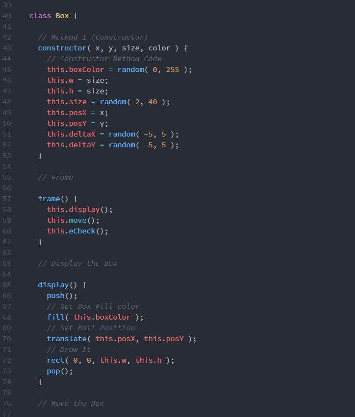

Dominic Rosatti 51

# HW - 11

## Summary

This was a close call kind of project, with my problems being solved very close to the due time, but I had a decently fun time writing this. Learning to use arrays a little better was definitely fun, and making headway with better understanding this odd form of coding was refreshing.

## Steps

After following along with the examples in class, I was still a little confused. My original idea was to have a bunch of stars, but I realized I might be asking too much of myself with something like that. Instead, I opted to use boxes, as boring as they were, for this project. It made more sense for me to do something I could handle than something I might not be able to.

Once I was done with all of the basic coding, I started having problems once I tried using my own variables. I played around until I ended up without errors, but with a blank screen. It was then that I put the call out on the class website, and the professor (probably the one reading this, hello Professor Musick!) answered me with the solution, which should have been staring me in the face. I then made my necessary changes, randomizing size and shade of gray, and viola.

## Learning that Warrents Discussion

I definitely need to make sure I understand arrays and loops. They've been the worst part of my understanding of this course so far.

## Issues

As I stated in my steps, I had issues with my code both in error and showing up as a blank screen. I want to thank my Professor again for showing me the problem, and letting me fix it. Thanks~

 ## Work Screenshot

 Oo-raw.
 

## Conclusions

Well, up next seems to be the final project, or at least, the reveal of it. I'm nervous, but excited to see what's next. Let's do it.

G'nite everybody.

 ~*Dominic, AKA DomTSVG*

 
