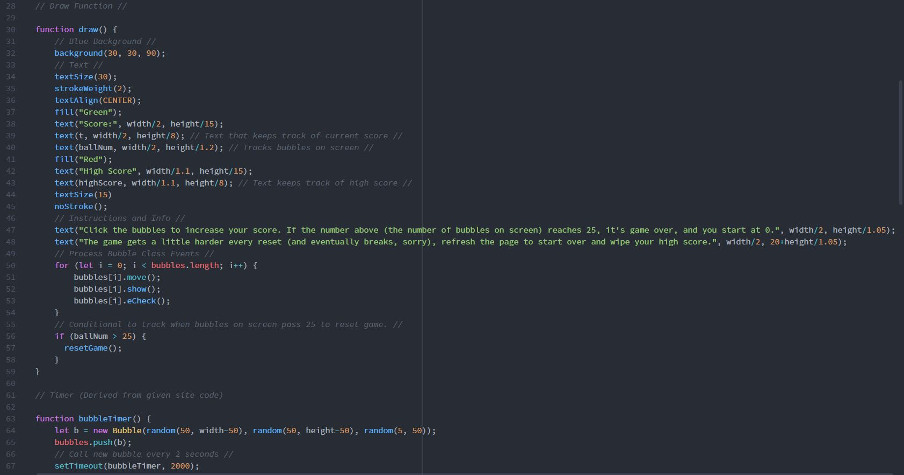

Dominic Rosatti 51

# HW - 12

## Summary

Aw, yes. Finally, something in coding goes right for me. It's a goddamned miracle, if you ask me. This was an absolute bitch, but I got it done and I'm very proud of what's been done. Feast your eyes on the final form of the bubble pop game... Now with scoring!

Maybe I should make an app out of this... Wouldn't that just be dumb, huh?

## Steps

Steps, righto'. As usual, it began with an idea, and building the basic code. The idea, obviously, was to spruce up the bubble pop game.

I then took that and made sure all my code to create bubbles in a specific timeframe and size range, and designed the bubbles in their "Class" setup.

In building my sketch, I wanted a way to "reset" the game, or rather, the sketch, and found a great video on doing so. Here it is:
https://www.youtube.com/watch?v=lm8Y8TD4CTM

Once I was done with that, I created variables for keeping track of both on-screen bubbles and score, and keeping track of each seperately. This meant making sure my code that reset the sketch didn't alter the Highscore variable. During this phase I also made sure that the 25 bubbles in the index are taken care of properly, and each deleted after the total number of these objects in the index reaches a certain threshold.

Then, I simply wrote out the instructions, and made sure the code was neat and tidy. Boom, done.

## Learning that Warrents Discussion

Not much, really. I think there should be more discussed on the idea of resetting a sketch, like in the video I provided above. It's almost invaluable if creating a game of sorts like I did, or clearing excess objects from a sketch so it does not overload memory or anything like that.

## Issues

One bug that I still cannot fix is one that makes my bubbles spawn at faster intervals after a reset, incrementally. This will eventually cause the indexing to break, as the code creates more than the splice code deletes, and this will happen no matter what threhold you implement. I'm unsure as to what part of my code causes this constant increase in bubble number. If anyone knows why, and how I can fix it, shoot me a comment, message, or if that's not your style, hit me up on my social media somewhere. You can find me by the username I present here all the time, DomTSVG. For example, my Twitter account is //@DomTSVG//.

 ## Work Screenshot

 Raw, dawg. (I'm sorry)
 

## Conclusions

There are tons of game engines out there that provide many of the coding themselves, or do it in the background. Making a game from scratch like this is rough and very time consuming, and it gives someone a new respect for the art form. That's all I really have to say.

Gooooooooood..... night.

 ~*Dominic, AKA DomTSVG*

 
