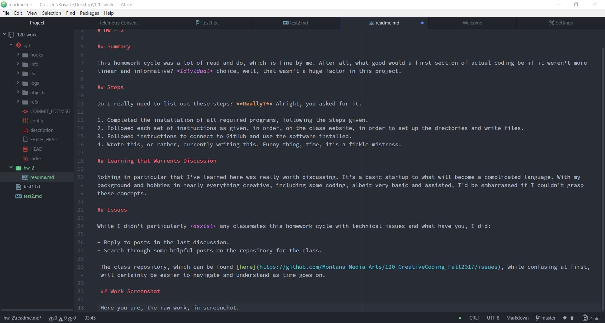

Dominic Rosatti 51

# HW - 2

## Summary

This homework cycle was a lot of read-and-do, which is fine by me. After all, what good would a first section of actual coding be if it weren't more linear and informative? *Idividual* choice, well, that wasn't a huge factor in this project.

## Steps

Do I really need to list out these steps? **Really?** Alright, you asked for it.

1. Completed the installation of all required programs, following the steps given.
2. Followed each set of instructions as given, in order, on the class website, in order to set up the drectories and write files.
3. Followed instructions to connect to GitHub and use the software installed.
4. Wrote this, or rather, currently writing this. Funny thing, time, it's a fickle mistress.

## Learning that Warrents Discussion

Nothing in particular that I've learned here was really worth discussing. It's a basic startup to what will become a complicated language. With my background and hobbies in nearly everything creative, including some coding, albeit very basic and assisted, I'd be embarrassed if I couldn't grasp these concepts.

## Issues

While I didn't particularly *assist* any classmates this homework cycle with technical issues and what-have-you, I did:

- Reply to posts in the last discussion.
- Search through some helpful posts on the repository for the class.

 The class repository, which can be found [here](https://github.com/Montana-Media-Arts/120_CreativeCoding_Fall2017/issues), while confusing at first, will certainly be easier to navigate and understand as time goes on.

 ## Work Screenshot

 Here you are, the raw work, in screenchot.
 

 How scandalous!

## Conclusions

 Well, it seems that that's it for now. A fine start, and a fine test editor. Not one for the common consumer, but hey, that's why we have Google Docs and the like. Use that instead of office, by the way. It's a freakin' scam, Adobe too. So overpirced. Yeesh. (*I mean come on, 50$ a month unless you're a student? That's 3 times as much as you'd pay for Netflix. Yeah, you get everthing, but what if you forget? That's 600$ a year, and last time I checked, that's a far cry more than originally paying a single fee.*)

 Not sure if it was okay to rant on the prices of software, but whatever. My readme, my rules... To an extent. You know what I mean.

 Goodnight everybody!

 ~*Dominic, AKA DomTSVG*

 
