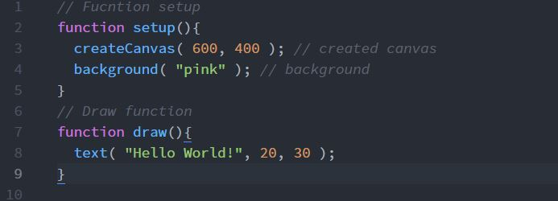

Dominic Rosatti 51

["Hello World!" Sketch](https://domtsvg.github.io/120-work/hw-3/)

# HW - 3

## Summary

I'm going to be rather blunt and simple here, yet again. This was an easy section of the class and I found it very easy to understand and to do. The code isn't hard, and I will continue to practice with this basic format.

## Steps

Do you want crippling boredom? Because this is how you get crippling boredom. The steps were exactly as they were on the site, no deviation here. Simply following the rules, 'eyup.

## Learning that Warrents Discussion

I'll say it again, nothing during this cycle was too tough, and I find little to be discussed here. I've known a few of these rules and such for quite some time anyway. And trust me, you'd rather I not make up some weird things to discuss, it'll be blatantly obvious.

## Issues

I had absolutely zero issue doing this. Really. Besides me misspelling ellipse twice because it's currently 6:00 AM, this project went smoothly.

 ## Work Screenshot

 Kapooyah.
 

## Conclusions

It's really funny to me, really. I spend a lot of time worrying about understanding the things I'm reading, and if these concepts will fly over my head, but to be frank, this has been a blast and a breeze. I've got nothing more to say. Here's to more happy, successful projects in the future.

 And now I should probably close my eyes. Goodnight everybody!

 ~*Dominic, AKA DomTSVG*

 
