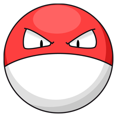
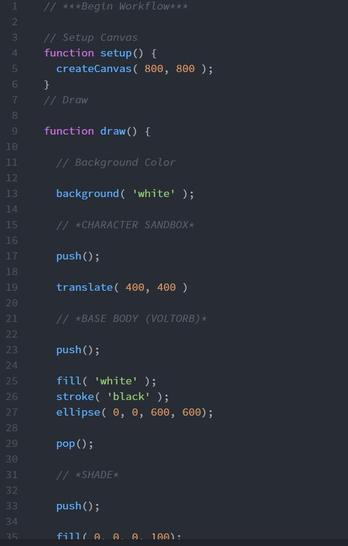

Dominic Rosatti 51

# HW - 4

## Summary

Well if this project wasn't a pain in my side. It's tough to make a huge jump from just drawing a bit of text to an actual, coherent picture. It took me a lot longer than I anticipated to complete this. Even a simple design for the portrait, the "monster" I chose, it was rough getting everything the way I wanted.

The "monster" I chose is a Pocket Monster, a Pokemon. I chose Voltorb for its simple design, one that I could practice and hone.

Nothing said I couldn't use it after all, and well, I can't even draw humans on paper. This was the perfect practice, the perfect first sketch. I had a blast.

## Steps

I went through a pretty boring process during this project. I started with a nice base and made a few shapes, the usual. I had to play around with negative values for coordinates after translating several times before I got the triangular eyes correct. After that, I found it much easier to assign coordinates due to their reference. The shine and the shade came after the pupils and iris, and the shade was what I had the roughest time with. It's really funny actually, just how hard it can be to rotate something properly.

## Learning that Warrents Discussion

I think I've done all the learning I can do here, besides further practice. Everything is pretty straightforward now, though, I find that I need to figure out radians in this program in a more efficient way.

## Issues

I fixed any syntax errors I had and made sure spelling was correct and everything. I'm not going to write a novel about that. Just general work polishing code.

 ## Work Screenshot

 Shazamo. Some raw work.
 

## Conclusions

This... This is the worst way I've ever drawn anything, ever. I'm not kidding. This whole process of trying to draw a portrait with code is just ridiculous. I'm happy I chose a simple monster design over a human, and I'm preferably never going to use this kind of coding for any kind of real art. I've never been so underwhelmed with the amount of work for a drawing of this quality. Here's to the hope that later projects will be less about straight drawing, and more about animation and interactivity. Let's hope.

 I am officially finished. Goodnight everybody!

 ~*Dominic, AKA DomTSVG*

 
