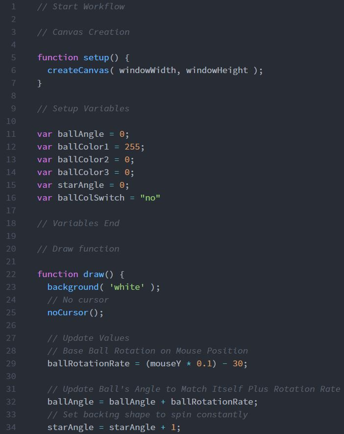

Dominic Rosatti 51

# HW - 5

## Summary

Ah, animation. One of the most wonderful forms of expression. Coding is a building block for tween animation and honestly, it's neat to code simple animation like this.

## Steps

I took a long while deciding on a way to do this project, and, in tune with my previous project's theme of "Pokemon" I went with a spinning Pokeball with a star/shine background. It's simple, again, but I'd rather it be simple. After setting up some variables, I went to constructing the Pokeball, and then the stars, made from triangles. I set up the spinning animation afterwards, and planned to include a color shifting effect. However, I could not get the shifting to work as I wanted. It's unfortunate but true.

## Learning that Warrents Discussion

I want to learn more about properly combining if/then statements in order to make the color shifting work. I played with it for hours but I could not get it set up correctly. I want to learn more about animation in other forms as well.

## Issues

As I told you before, I had issues setting up the color shift using if/then statements. I had to give up due to time constraints.

 ## Work Screenshot

 Raw work. Raw like the meat in the freezer.
 

## Conclusions

This project was basic and fun, though I wish I'd accomplished more. Oh well, a lesson learned, and knowledge gained.

 Goodnight everybody!

 ~*Dominic, AKA DomTSVG*

 
