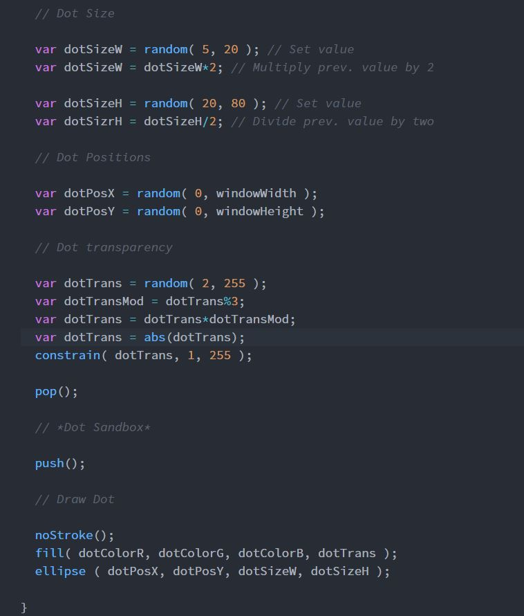

Dominic Rosatti 51

# HW - 6

## Summary

I hate math, really. I know it's a necessity to life, and everything we do, but that doesn't mean I have to like it. That aside though... This project was really fun. Seriously, I never knew I'd have such a great time making a stupid bunch of dots. I had a blast.

## Steps

Obviously first I needed to set up my variables and canvas. Since the color of the dots was going to be important, I wanted to make sure that the background was white. Then, each Variable's name was set up for use later.

Next, obviously, I went about sandboxing and setting up the generators for the values of the dots. Because I absolutely had to adhere to the constraints given in the directions, the need for the absolute value function is nearly nonexistant, but the constrain code string was necessary for transparency.

Lastly, of course, I coded the drawing of the dots, and viola.

## Learning that Warrents Discussion

I still need to figure out how a few of the things we discussed in the class today work. Things like mapping, ceilings and floors.

## Issues

I had no issues during the actual coding this week, surprisingly.

 ## Work Screenshot

 Raw, raw, raw-ah-ah.
 

## Conclusions

This was fun, despite my hate for math. I'm very happy with what I've done here. Not much more to say, enjoy my colorful dots.

 Goodnight everybody!

 ~*Dominic, AKA DomTSVG*

 
