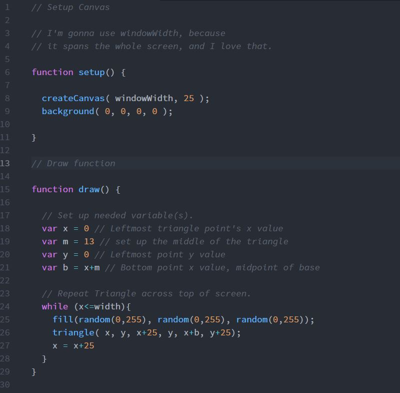

Dominic Rosatti 51

# HW - 8

## Summary

Hoo boy, I dont know what it is, by my laptop is basically dead. I experienced so many lockups doing this project, I had to stop and make due with what I had. It's not terrible, mind you, just go easy on me, please. I ended up with what I'd say is a string of flashing triangles across the width of the browser/screen's top, all flashing different colors.

## Steps

I started by setting up the canvas and the variables in the draw function.

Then, I spent a huge amount of time getting my laptop's disk usage cooked for some reason, trying to use for loops that didn't work, for a reason I cannot for the life of me understand. I needed to downgrade to while loops. I'll have to get my laptop looked at and explore why my for loops did not work.

## Learning that Warrents Discussion

For loops. I need to learn why they did not work. And why they destroyed my laptop.

## Issues

See above, hoo boy did I have a hundred issues while coding this. Mostly, the For loops. I'm so, so confused as to why they refused to work. I'll be sure to go over the material again and get it working... Hopefully.

 ## Work Screenshot

 This code had the raw potential to kill my laptop. Witness.
 

## Conclusions

While I was looking forward to having some fun with loops, I got a huge issue with my system. I swear, there's some kind of demon haunting my code.

 Don't be careless with For Loops kids,

 ~*Dominic, AKA DomTSVG*

 
